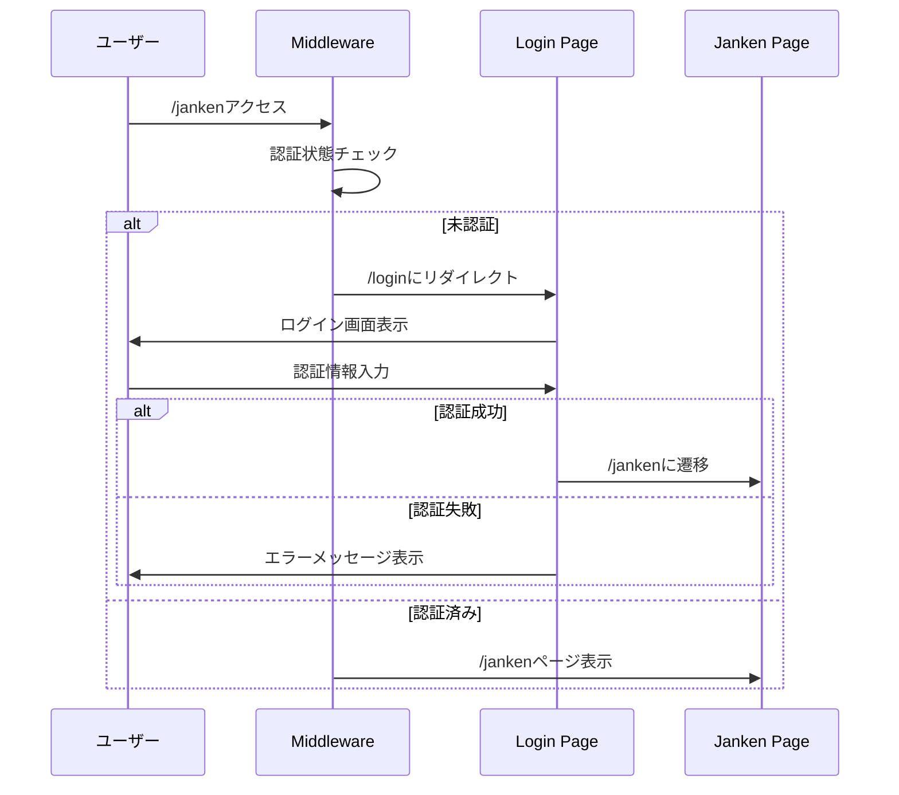
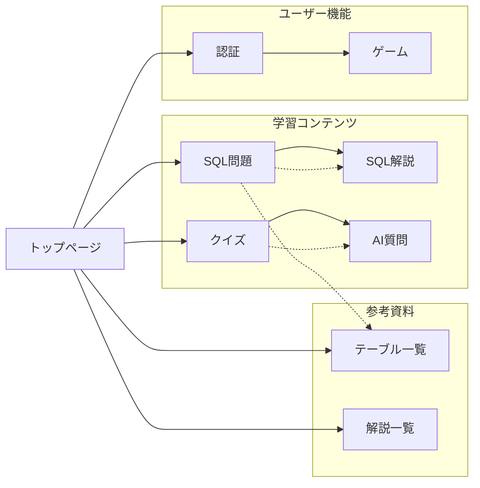

# Nuxt Memo App 画面遷移図

PLAYWRIGHTとSequential Thinkingを使用して調査したWEBアプリの画面遷移をまとめました。

## 🗺️ 画面遷移図

```mermaid
graph TD
    A[トップページ /] --> B[クイズページ /quiz]
    A --> C[ログインページ /login]
    A --> D[個別SQL問題 /sql/[id]]
    A --> E[SQLテーブル一覧 /sql/allTables]
    A --> F[SQL解説 /sql/explanation]
    
    C --> G[じゃんけんゲーム /janken]
    C -.->|認証失敗| C
    
    D --> H[前の問題 /sql/[id-1]]
    D --> I[次の問題 /sql/[id+1]]
    D --> J[SQL解説詳細 /sql/explanation/[keyword]]
    
    F --> K[SELECT解説 /sql/explanation/SELECT]
    F --> L[INSERT解説 /sql/explanation/INSERT]
    F --> M[UPDATE解説 /sql/explanation/UPDATE]
    F --> N[DELETE解説 /sql/explanation/DELETE]
    F --> O[JOIN解説 /sql/explanation/JOIN]
    F --> P[WHERE解説 /sql/explanation/WHERE]
    F --> Q[GROUPBY解説 /sql/explanation/GROUPBY]
    F --> R[ORDERBY解説 /sql/explanation/ORDERBY]
    F --> S[COUNT解説 /sql/explanation/COUNT]
    F --> T[SUM解説 /sql/explanation/SUM]
    
    %% 認証保護
    U[/jankenで始まるルート] -.->|未認証| C
    
    %% 戻るリンク
    B -.->|トップ| A
    D -.->|トップ| A
    E -.->|トップ| A
    F -.->|トップ| A
    J -.->|トップ| A
    K -.->|トップ| A
    L -.->|トップ| A
    M -.->|トップ| A
    N -.->|トップ| A
    O -.->|トップ| A
    P -.->|トップ| A
    Q -.->|トップ| A
    R -.->|トップ| A
    S -.->|トップ| A
    T -.->|トップ| A
    
    classDef auth fill:#ff9999
    classDef sql fill:#99ccff
    classDef quiz fill:#99ff99
    classDef home fill:#ffcc99
    
    class C,G auth
    class D,E,F,J,K,L,M,N,O,P,Q,R,S,T sql
    class B quiz
    class A home
```

## 📱 各ページの詳細

### 1. トップページ (/)
**機能**: アプリケーションのメインハブ
- **ナビゲーション**:
  - ジャンケン → `/janken` (認証が必要)
  - クイズ → `/quiz`
  - SQL → `/sql`
  - SQLテーブル一覧 → `/sql/allTables`
  - SQL解説 → `/sql/explanation`
- **SQL問題一覧**: カテゴリ別（DELETE、INSERT、SELECT、UPDATE）
- **問題リンク**: 各問題への直接アクセス（`/sql/1`、`/sql/2`等）

### 2. クイズページ (/quiz)
**機能**: 多様なクイズ機能を提供
- **一般知識クイズ**: 「What is the capital of France?」等
- **ランダム計算クイズ**: 数式問題（例: 10 ÷ 10 = ?）
- **AIに質問**: OpenAI統合による質問機能
- **ナビゲーション**: トップへ戻るリンク

### 3. 個別SQL問題ページ (/sql/[id])
**機能**: インタラクティブなSQL学習環境
- **問題表示**: 具体的なSQL課題（例: 「ユーザーの名前を取得する」）
- **テーブル表示**: 関連するデータベーステーブル
- **SQLエディター**: リアルタイムSQL実行環境
- **AI統合**: 「AIに質問」ボタンでヒント取得
- **ナビゲーション**: 
  - 前へ/次へボタンで問題間移動
  - SQL解説への関連リンク
- **解答確認**: 解答状態の表示

### 4. SQLテーブル一覧ページ (/sql/allTables)
**機能**: データベース構造の参照
- **テーブル表示**: 
  - users（id, name, age）
  - customers（id, name, age）
  - products（id, product_name, stock）
  - orders（id, user_id, total_amount）
- **データ内容**: 各テーブルの実際のレコード表示

### 5. SQL解説ページ (/sql/explanation)
**機能**: SQL概念の体系的説明
- **解説項目**:
  - SELECT（データ取得）
  - INSERT（データ追加）
  - UPDATE（データ更新）
  - DELETE（データ削除）
  - JOIN（テーブル結合）
  - WHERE（条件指定）
  - GROUP BY（グループ化）
  - ORDER BY（並び替え）
  - COUNT（件数集計）
  - SUM（合計集計）
- **詳細ページ**: 各概念の詳細説明ページへのリンク

### 6. ログインページ (/login)
**機能**: ユーザー認証
- **入力項目**: 
  - メールアドレス
  - パスワード
- **エラーハンドリング**: 認証失敗時のエラーメッセージ
- **自動リダイレクト**: 認証が必要なページアクセス時に自動表示

### 7. じゃんけんゲーム (/janken)
**機能**: 認証後のゲーム機能
- **アクセス制御**: 認証が必要（未認証時は自動的に`/login`にリダイレクト）

## 🔐 認証フロー



## 🧭 ナビゲーションパターン

### 共通ナビゲーション
- **トップ戻り**: ほぼ全てのページからトップページへのリンク
- **ブレッドクラム**: SQL関連ページでの階層ナビゲーション

### SQL学習フロー
1. **エントリーポイント**: トップページの問題一覧 or SQLメニュー
2. **学習サイクル**: 
   - 問題確認 → SQL実行 → 結果確認 → 次の問題
   - 必要に応じて解説ページ参照
   - AIによるヒント取得
3. **参考資料**: テーブル一覧ページでデータ構造確認

### クイズ学習フロー
1. **多様な問題形式**: 一般知識、計算、AI対話
2. **即座のフィードバック**: 正解/不正解の即時表示
3. **継続学習**: 次の問題への自動遷移

## 🎯 技術的特徴

### ルーティング
- **ファイルベースルーティング**: Nuxt 3の標準パターン
- **動的ルート**: `/sql/[[id]].vue`でSQL問題の動的生成
- **ミドルウェア**: `auth.global.ts`による認証制御

### 状態管理
- **コンポーザブル中心**: `useSqlQuiz()`, `useAuth()`等
- **ローカルストレージ**: 認証状態の永続化
- **リアクティブ状態**: Vue 3 Composition API

### データフロー
- **静的データ**: JSONファイルによる問題・解説管理
- **ブラウザ内SQL**: AlaSQL使用でサーバーレス実行
- **AI統合**: OpenAI APIによる学習支援

## 📊 ページ間関係図



## 📝 調査メモ

### 使用ツール
- **PLAYWRIGHT**: ブラウザ自動化による画面遷移確認
- **Sequential Thinking**: 体系的な調査アプローチ

### 発見事項
1. **認証保護**: `/janken`ルートのみ認証が必要
2. **SQL実行環境**: ブラウザ内完結のSQL学習環境
3. **AI統合**: 学習支援のためのOpenAI活用
4. **レスポンシブ対応**: モダンなTailwindCSS実装
5. **日本語UI**: 全インターフェースが日本語対応

### 改善提案
- 認証後のダッシュボード追加を検討
- SQL問題の進捗管理機能
- より詳細なエラーハンドリング

---

**調査日**: 2025年7月28日  
**調査方法**: PLAYWRIGHT + Sequential Thinking  
**対象バージョン**: Nuxt 3 (feature7ブランチ)
